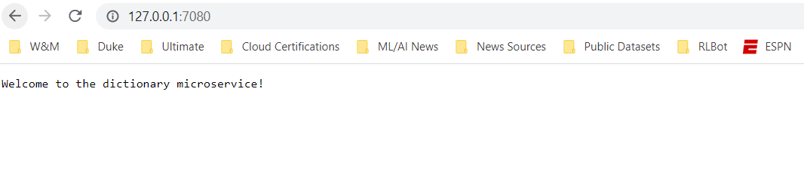
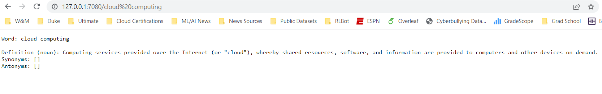

# dictionary-microservice

## Description

This project is a microservice that acts as a combined dictionary and thesaurus. It takes an word as an input and return the definition, part of speech, synonyms, and other information. This is achieved through the use of the [Free Dictionary API](https://dictionaryapi.dev/). For any word that is entered, the part of speech and definitions are returned to the screen. If there are multiple definitions, they will all be output. For each of these definitions, there will be a list of synonyms and antonyms which may or may not be empty. You can run it locally using `cargo run` or with minikube using the steps described below. 

## Running the program locally

1) cd into the directory with `cd dictionary-microservice`
2) Run the program using `cargo run`
3) Go to [this url](http://localhost:8080)

### Push the image to DockerHub

1) login to docker using `docker login` and enter your credentials
2) `docker build -t dictionary-microservice .`
3) `docker tag dictionary-microservice:latest brycewhit13/dictionary-microservice:latest`
4) `docker push brycewhit13/dictionary-microservice:latest`

## Build and run your Docker Container

1) Build with: `docker build -t dictionary-microservice .`
2) Run with: `docker run -it --rm -p 8080:8080 dictionary-microservice`

## Running with minikube

1) Download the minikube command-line tool [here](https://minikube.sigs.k8s.io/docs/start/)
2) Start the minikube service with `minikube start`
3) Create an alias using `alias kubectl="minikube kubectl --"`
4) Download the correct kubectl version: `kubectl get po -A`
5) Create a deployment: `kubectl create deployment dictionary --image=registry.hub.docker.com/brycewhit13/dictionary-microservice`
6) Create a service and expose it: `kubectl expose deployment dictionary --type=NodePort --port=8080`
7) Foward the port to the local 7080: `kubectl port-forward service/dictionary 7080:8080` and go to [this url](http://localhost:7080)
8) Delete the deployment for cleanup: `kubectl delete deployment dictionary`
9) Delete the service for cleanup: `kubectl delete service dictionary`
10) Stop the minikube service: `minikube stop`

## Welcome Page

## Dictionary Page

